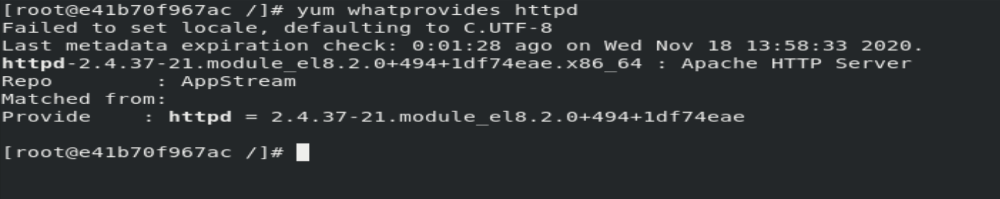
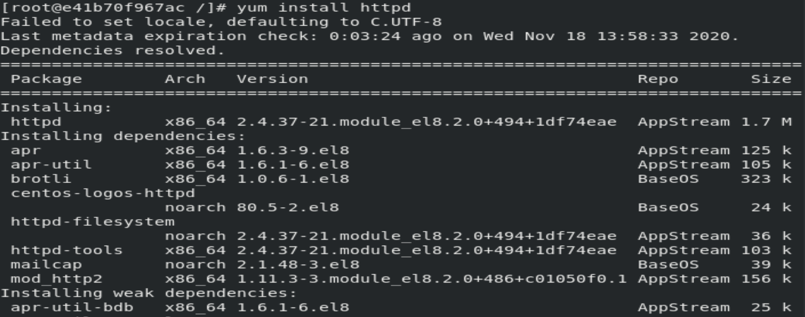
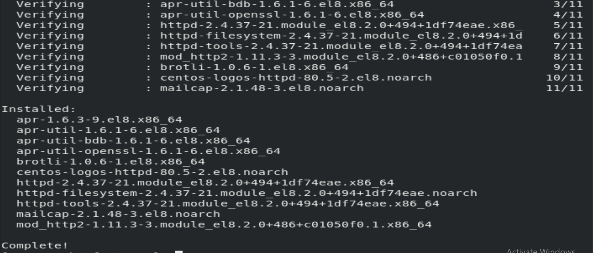
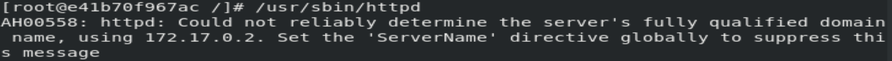

# Docker_task-7.2-a-
Configuration of Httpd server on Docker Container.

First of all i have started the docker service by using command:- systemctl start docker

Then i have launch/start a os with name my os of centos.by using command :-
docker run -it --network host --name myos centos:latest

To install http server first of all i need to check which software provide httpd service.
so i use the command:- yum whatprovides httpd

finally using the command:- yum install httpd, ihave successfully installed httpd server on one of instance(container) of docker.

To configure/ or serve a .html file via httpd server we have to put our .html file at location:- /var/www/html/
Then successfully i have started httpd server by using command:-/usr/sbin/httpd

